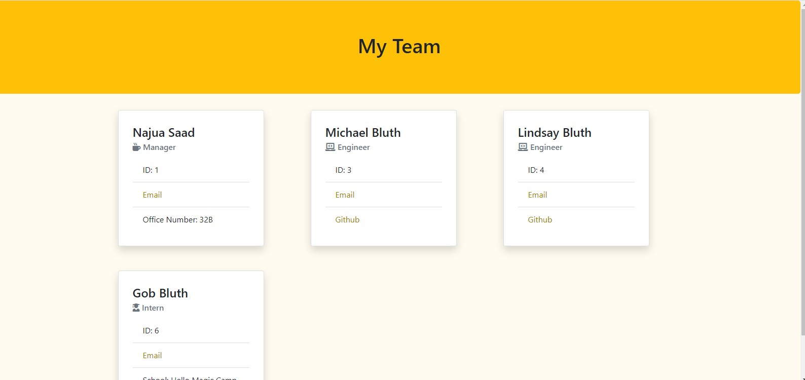

# Team Roster Generator

## Description
An easy to use command line program that provides you with a fully styled custom HTML page including your team's pertinent information.

## User Story
AS A manager of a team
I WANT to create a team roster
SO THAT my team can be easily contacted and viewed

## Usage
To use, run node on the index.js file. Before running, make sure the node modules are installed. Be prepared with the name, employee id, and email of every employee as well as their github username, office number, or school where it necessary.

## Test
There is a test page for every class. Install jest to the dev dependencies to run the tests.

## Github Link
[Github Repo](https://github.com/najuasaad/TeamRosterGenerator)

## Screenshot

